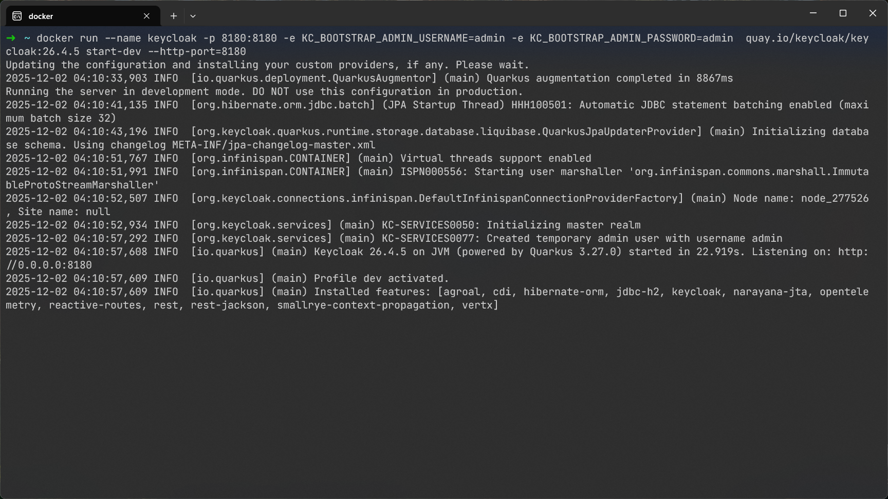
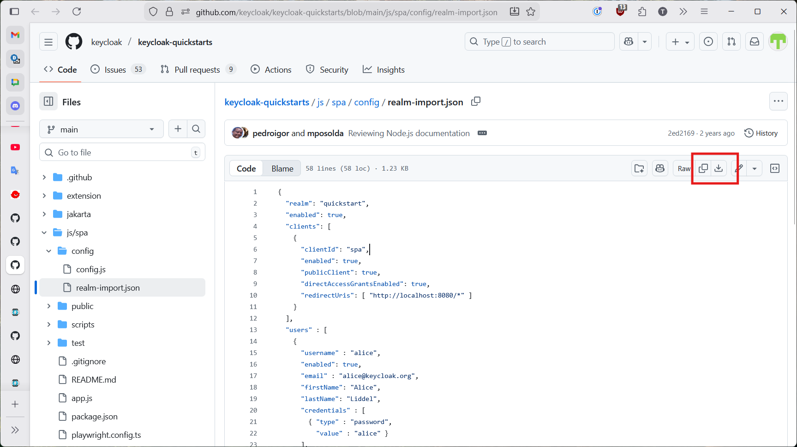
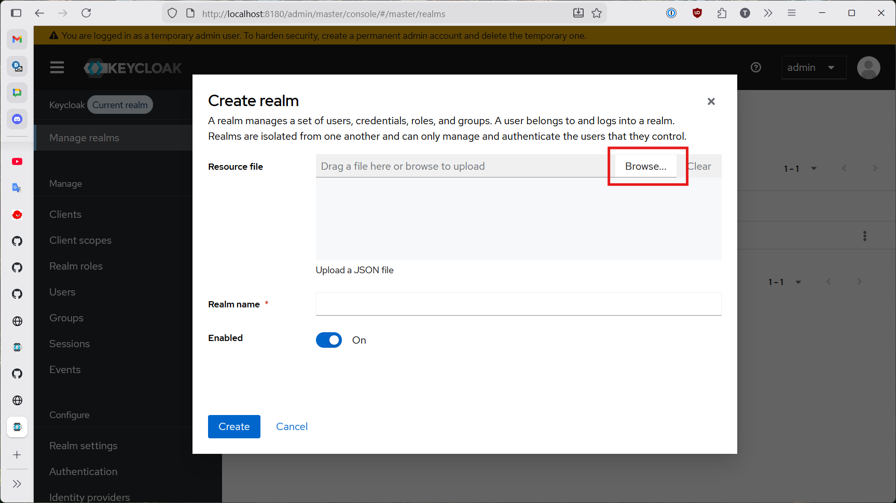
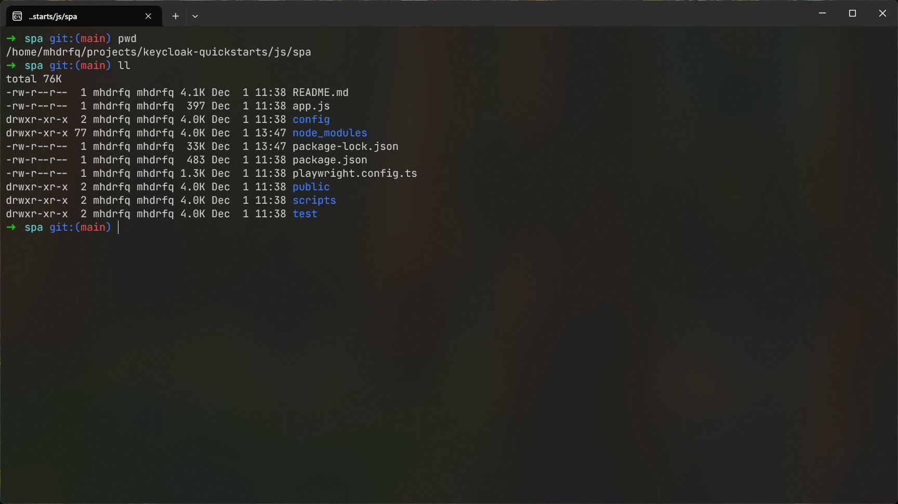
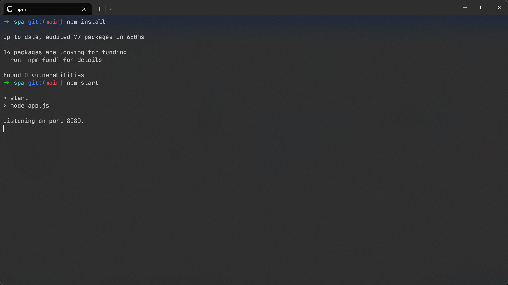
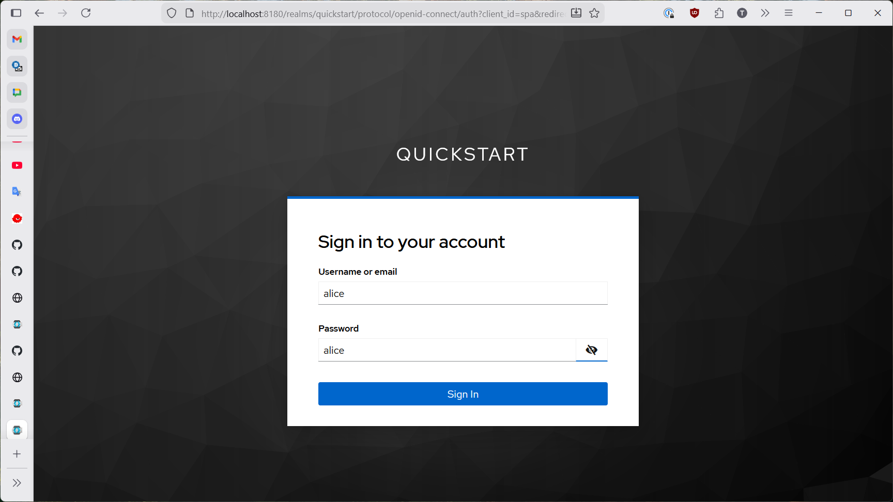
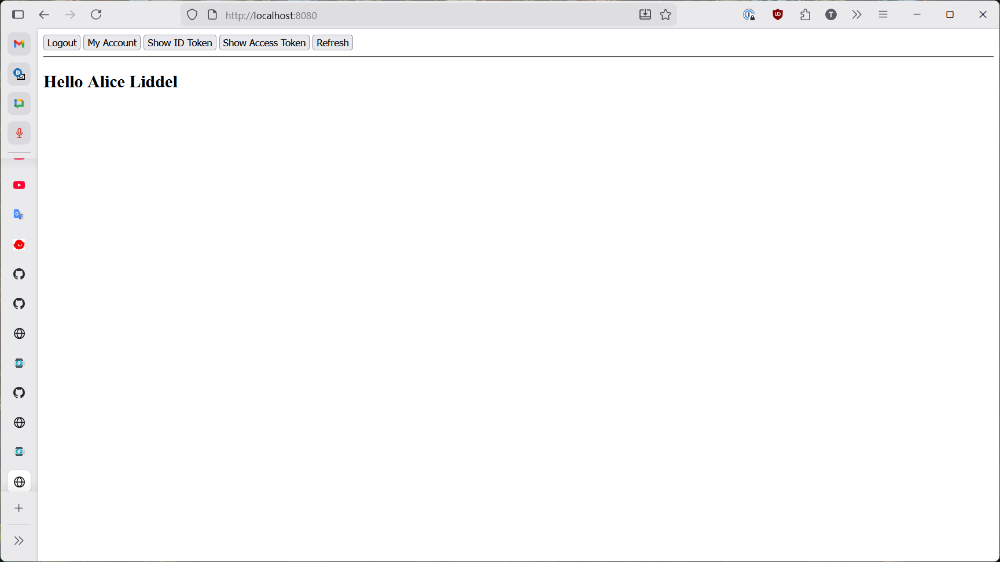

**最終更新日：2025年12月（作成者：Rofiq）**

# How to implement Keycloak in a JavaScript-based Single Page Application (SPA)

this guide explains the basics of how you can implement keycloak onto a javascript based single page application. the guide only is only meant to walk you through an example bare bones implementation and run it locally.

we will be using the quickstart project that can be found here: [keycloak-spa-quickstart](https://github.com/keycloak/keycloak-quickstarts/tree/main/js/spa)

## Prerequisites

please use WSL if you are on Windows.

To compile and run this quickstart you will need:
- Node.js 18.16.0+
- Keycloak 21+
- Docker 20+

## Starting and Configuring the Keycloak Server

if you followed the previous keycloak setup guide, you will perform the same step in order to start the keycloak server and access the keycloak admin console. compared to the docker run command from the setup guide, this command differs from these points:

- given the container a name "keycloak"
- map the host port 8180 to container port 8180
- tell keycloak to listen to port 8180 instead of deafault 8080

run the following command in your bash terminal to start keycloak in docker. dont forget to have docker desktop open while doing this to see make sure that the container is actually running.

```bash
docker run --name keycloak -p 8180:8180 -e KC_BOOTSTRAP_ADMIN_USERNAME=admin -e KC_BOOTSTRAP_ADMIN_PASSWORD=admin  quay.io/keycloak/keycloak:26.4.5 start-dev --http-port=8180
```

feel free to change the keycloak version specified in the command to the latest version available if you want to. 



once the keycloak server is running in docker through the command, access the keycloak admin console the same way you did in the previous guide, using the username and password `admin`. 

next, you will import the realm provided in by the quickstart from here: [realm-import.json](https://github.com/keycloak/keycloak-quickstarts/blob/main/js/spa/config/realm-import.json). from the link above, you can either copy paste the json or click the download button to download the json file itself. i've also pasted the raw json below for convenience.



```json
{
  "realm": "quickstart",
  "enabled": true,
  "clients": [
    {
      "clientId": "spa",
      "enabled": true,
      "publicClient": true,
      "directAccessGrantsEnabled": true,
      "redirectUris": [ "http://localhost:8080/*" ]
    }
  ],
  "users" : [
    {
      "username" : "alice",
      "enabled": true,
      "email" : "alice@keycloak.org",
      "firstName": "Alice",
      "lastName": "Liddel",
      "credentials" : [
        { "type" : "password",
          "value" : "alice" }
      ],
      "realmRoles": [ "user", "offline_access"  ],
      "clientRoles": {
        "account": [ "manage-account" ]
      }
    },
    {
      "username" : "admin",
      "enabled": true,
      "email" : "test@admin.org",
      "firstName": "Admin",
      "lastName": "Test",
      "credentials" : [
        { "type" : "password",
          "value" : "admin" }
      ],
      "realmRoles": [ "user","admin" ],
      "clientRoles": {
        "realm-management": [ "realm-admin" ],
        "account": [ "manage-account" ]
      }
    }
  ],
  "roles" : {
    "realm" : [
      {
        "name": "user",
        "description": "User privileges"
      },
      {
        "name": "admin",
        "description": "Administrator privileges"
      }
    ]
  }
}
```

the realm-import json configures the following attributes for the `quickstart` realm:

- One client (spa) for a local single-page app.
- Two users (a normal user and an admin).
- A couple of roles (user, admin) and some client-level permissions.

next, through the keycloak admin console, when creating a new realm, either paste the json you've copied from github into the Resource File input field or click the Browse button to select the json file you downloaded. then click Create.



your current realm should automatically become the new imported `Quickstart` realm. this is all we need to configure from the server side.

## Build and Deploy the Quickstart SPA

if you have not cloned the quickstart projects repository, please clone the quickstart github repository from [here](https://github.com/keycloak/keycloak-quickstarts/tree/main).

open a bash terminal and navigate to the root of the project. in this case, you have to navigate to the SPA quickstart project folder like what the image below shows. 



run the following commands to run the quickstart.

```bash
npm install
npm start
```



## Access the Quickstart SPA

You can access the application with the following URL: [http://localhost:8080](http://localhost:8080).

Try to login with any of these users:

| Username | Password | Roles |
|---------|----------|-------|
| alice   | alice    | user  |
| admin   | admin    | admin |




once authenticated, you can perform the actions written on each of the buttons at the top of the screen.

this marks the end of the quickstart.

## Walkthrough of the Quickstart SPA Source Code

now we will take a closer look at the source code of the keycloak implementation on the quickstart SPA. our aim is to try to understand what is actually programmed in the SPA that makes keycloak work in it.

