**最終更新日：2025年12月（作成者：Rofiq）** [JP](https://tomato-rofiq.github.io/tomato-manuals/keycloak/jp/setup) EN

# Docker 上で Keycloak を始める方法

本ガイドは、Keycloak.org が提供する公式「Getting Started」ドキュメント [getting-started-docker](https://www.keycloak.org/getting-started/getting-started-docker) をもとに、日本語の読者向けに作成されたものです。

このガイドは、Docker 上で稼働している Keycloak 管理コンソールの基本機能を使いこなすためのものです。
本ガイドを完了した後は、[JavaScript ベースのシングルページアプリケーション（SPA）に Keycloak を実装する方法](https://tomato-rofiq.github.io/tomato-manuals/keycloak/jp/quickjs) のガイドも併せてお読みください。

## 前提条件

公式ガイドでは使用するオペレーティングシステムに関する要件は特に示されていませんが、本ガイドでは Linux 環境または Mac OS 上での利用を推奨します。  

これは、Windows ユーザーの場合、Web 開発中に Windows 固有の問題を避けるため、便利な方法として Windows Subsystem for Linux (WSL) の使用をおすすめするという意味です。

WSL の使い方がわからない場合は、Microsoft の以下のドキュメントをご参照ください。[learn-wsl-install](https://learn.microsoft.com/en-us/windows/wsl/install)

また、本ガイドでは Docker も必要です。Docker Desktop がインストールされていることを確認してください。WSL ユーザーは、Docker Desktop の設定でデフォルトの Ubuntu ディストリビューションにアクセスできるように構成してください。

このガイドでは、Docker Desktop およびターミナルから Docker を使用する基本的な知識があることを前提としています。

## Keycloak の起動

Docker Desktop が起動していることを確認してください。

ターミナルを開きます。

ターミナルで、Keycloak を起動するために次のコマンドを入力します：

```bash
docker run -p 127.0.0.1:8080:8080 -e KC_BOOTSTRAP_ADMIN_USERNAME=admin -e KC_BOOTSTRAP_ADMIN_PASSWORD=admin quay.io/keycloak/keycloak:26.4.5 start-dev
```

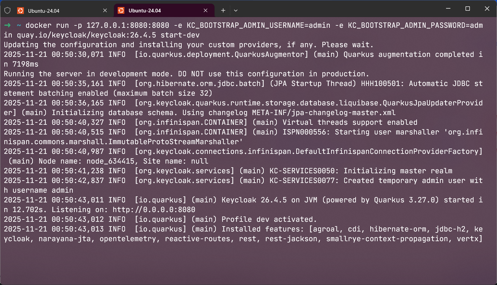

このコマンドは、Keycloak をローカルのポート 8080 で公開して起動し、ユーザー名 admin、パスワード admin の初期。

ターミナルは開いたままにして、イメージを実行し続けてください。  
また、Docker Desktop でイメージが実行中かどうかを確認することもできます。

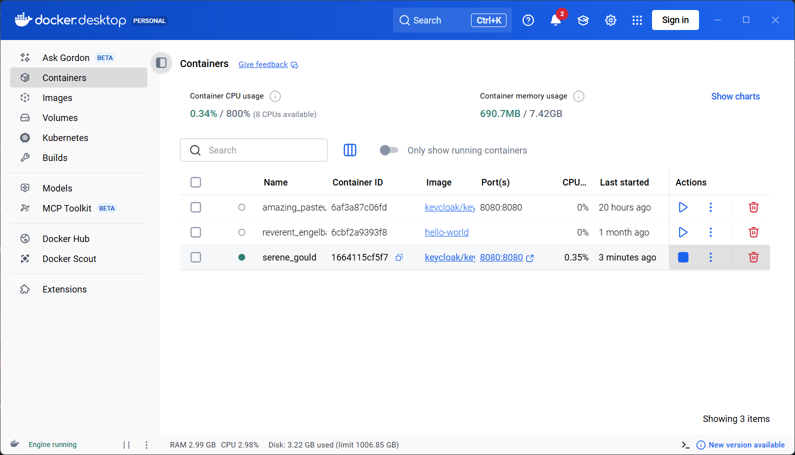

## 管理コンソールへのログイン

これで、[http://localhost:8080/admin](http://localhost:8080/admin) から Keycloak、より正確には Keycloak Admin Console にアクセスできます。

アクセスすると、Keycloak が提供するログイン画面が表示されます。


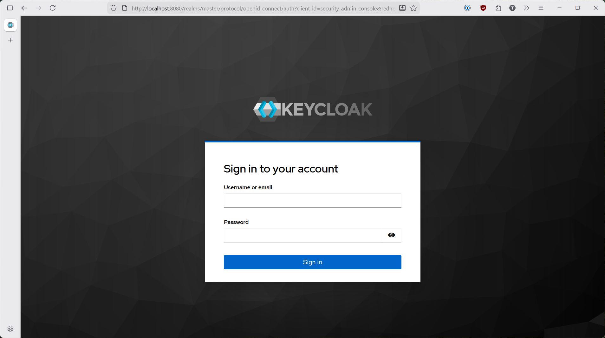

前にターミナルで実行した `docker run` コマンドでは、Keycloak Admin Console にログインするための一時的なユーザー名 `admin` とパスワード `admin` が指定されていました。

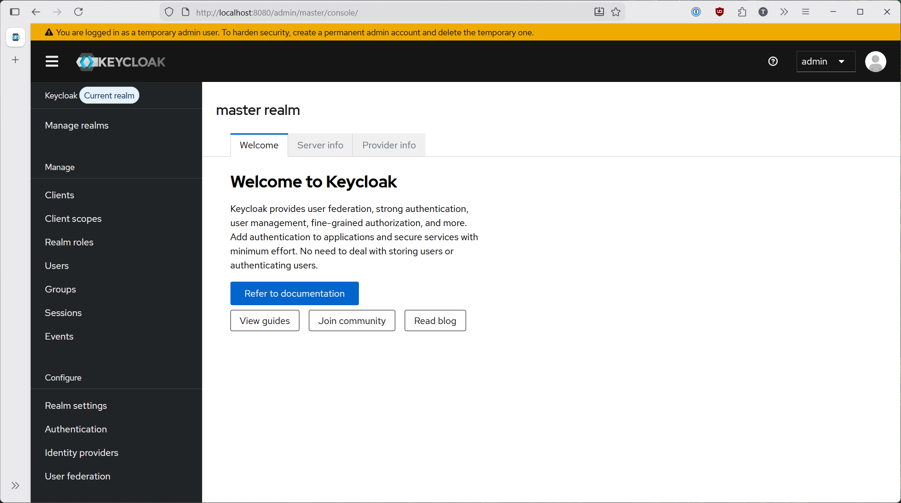

## Realm（レルム）の作成

Keycloak における realm（レルム） は、テナントに相当します。各レルムでは、管理者がアプリケーションやユーザーを分離して管理できます。初期状態では master と呼ばれるレルムが 1 つだけ含まれています。この master レルムは Keycloak 自体を管理するためのものであり、アプリケーションの管理には使用しないでください。

一般的に、1 つのレルムは 1 つのアプリケーション（Keycloak の用語では「クライアント」）で使用することが推奨されます。これは、レルム内でアプリケーションのユーザー向けのロールを定義できること、またクライアントに発行される JWT がレルム固有であるためです。

開発環境ごとにレルムを分けることもできます。例えば、開発（dev）、ステージング（staging）、本番（production）で 3 つのレルムを用意する運用があります。また、会社ごとにユーザーを分離したい場合は、myapp-company1、myapp-company2 のように複数のレルムを作成することも可能です。

それでは、最初のレルムを作成してみましょう。

1. 左側メニューから 「Manage realms」 をクリックします。
2. 「Create realm」 をクリックします。

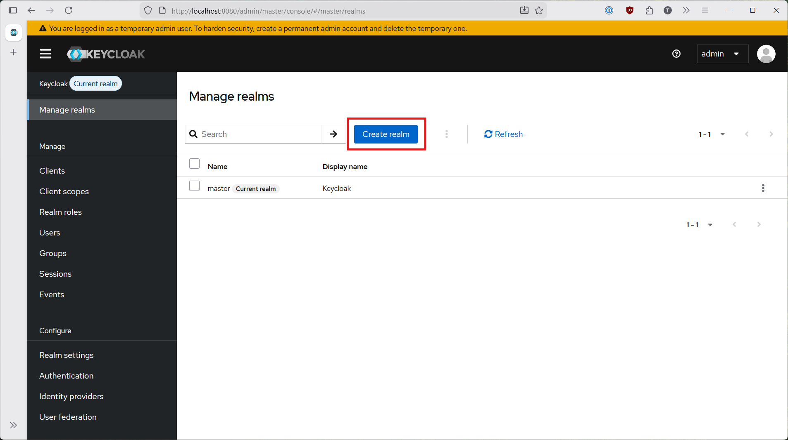

3. 「Realm name」欄に `myrealm` と入力し、**Create** をクリックします。  

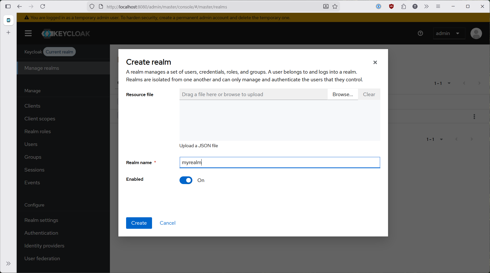
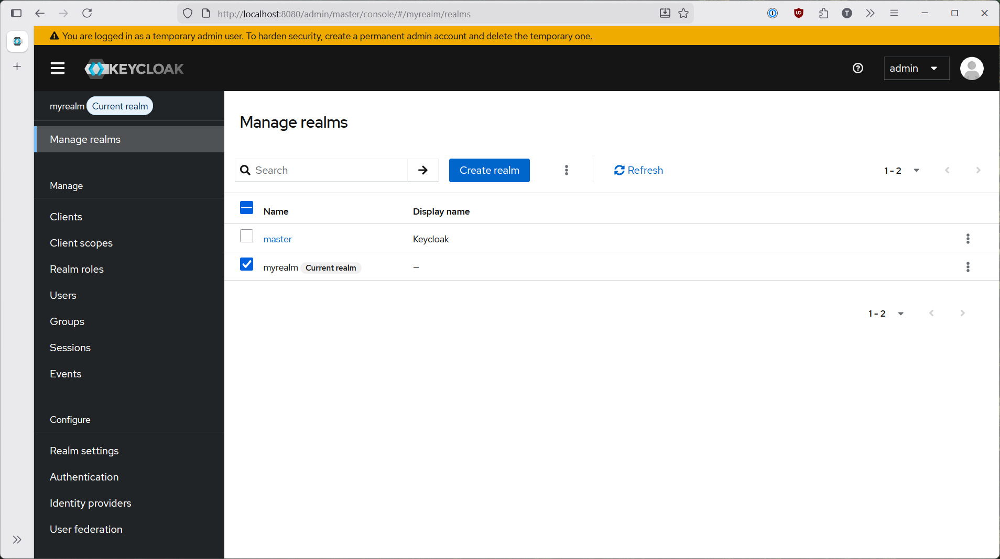

## ユーザーの作成

1. まだ `myrealm` レルムにいることを確認します。  
2. 左側メニューの 「Users」 をクリックします。  


3. 「Create new user」 をクリックします。  

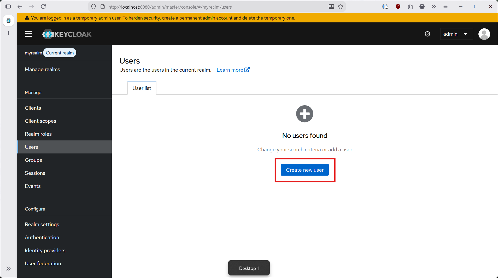
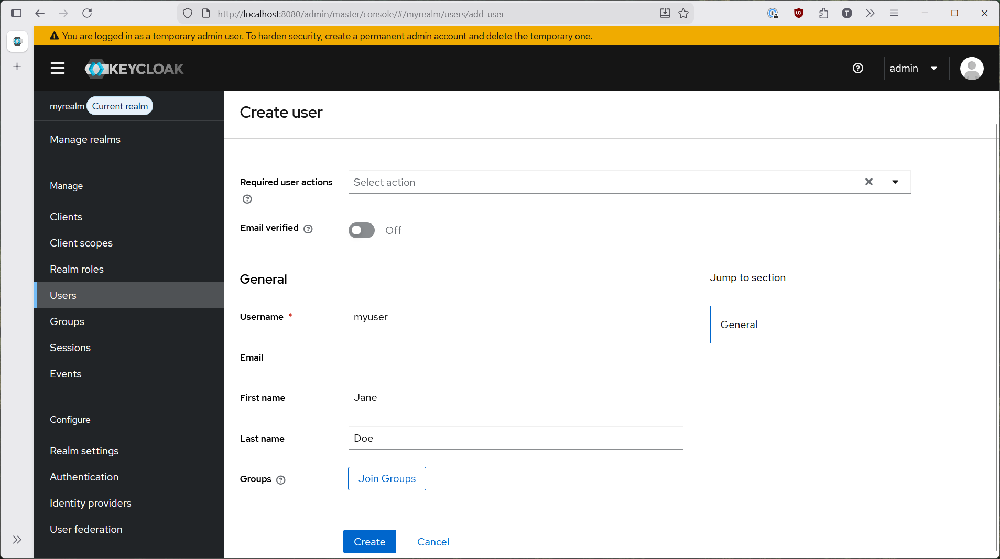

4. 以下の値でフォームを入力します：  
    - Username: myuser  
    - First name: 任意の名前  
    - Last name: 任意の名字  
5. 「Create」 をクリックします。  

ユーザーを作成しましたが、まだログイン用の認証情報はありません。次に、作成したユーザーにパスワードを設定します。  

1. ページ上部の 「Credentials」 をクリックし、「Set Password」 をクリックします。  

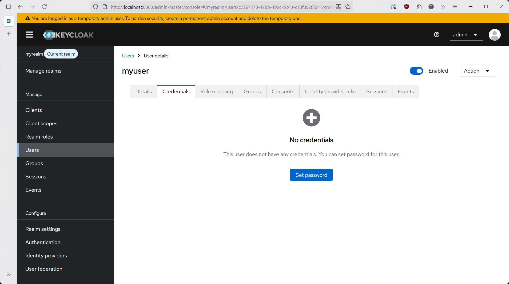

2. 「Set password」フォームにパスワードを入力します。  
3. Temporary を Off に切り替え、ユーザーが初回ログイン時にパスワードを変更する必要がないようにします。  
4. Save をクリックします。  

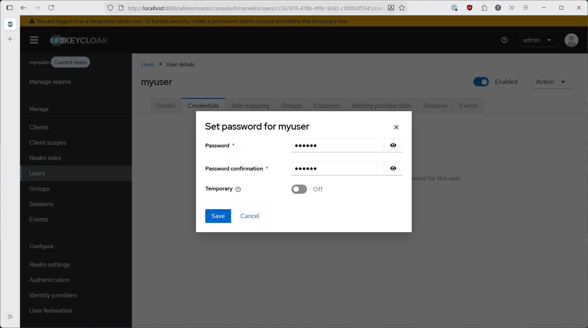
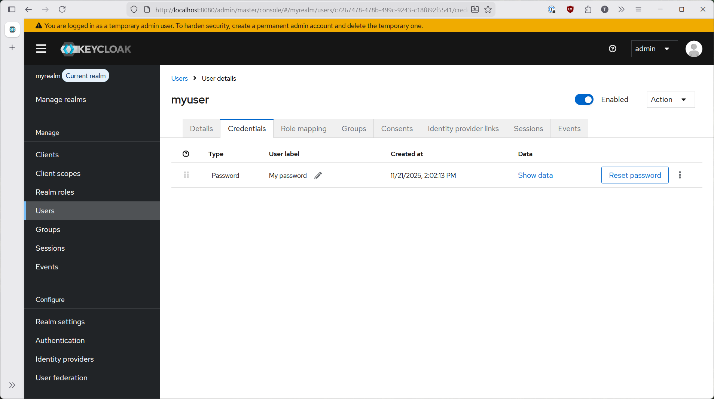

## 最初のアプリケーションを保護する

クライアントへの Keycloak の実装を試してみましょう。ここでいう「クライアント」とは、ユーザー認証のために Keycloak を利用する任意のアプリケーションを指します。このガイドでは、Keycloak が提供しているテスト用の SPA（シングルページアプリケーション）を使用します。詳細はこのセクションの後半で説明します。

まず、現在の Realm が、このガイドで作成した「myrealm」になっていることを確認してください。

1. 左メニューから「Clients」をクリック
2. 「Create client」をクリック

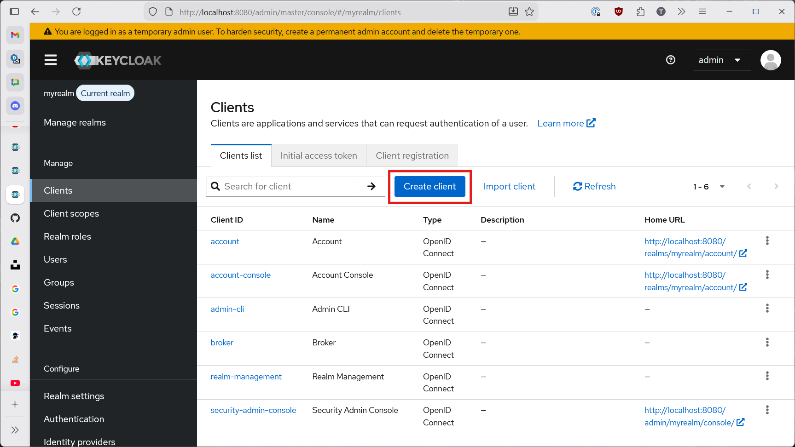

3. 次の値を入力します：
    - Client type: OpenID Connect
    - Client ID: myclient

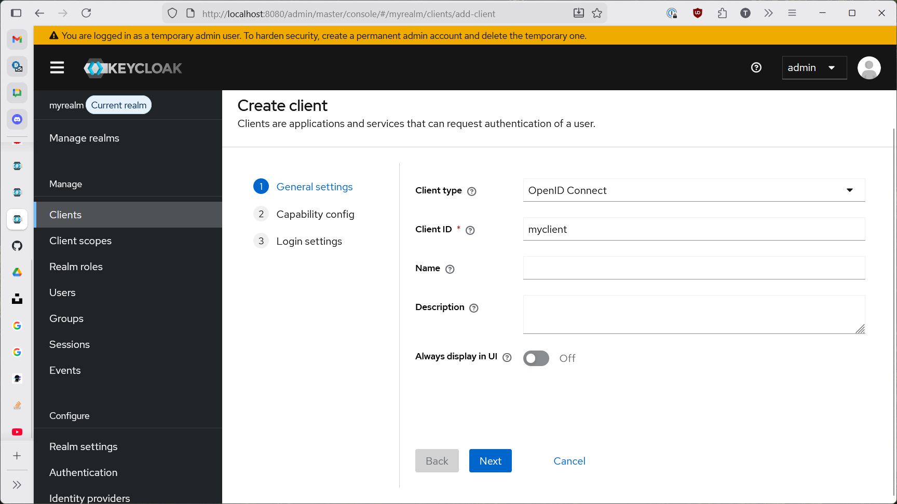

4. 「Next」をクリックします  
5. Authentication Flow の項目で Standard Flow にチェックが入っていることを確認します

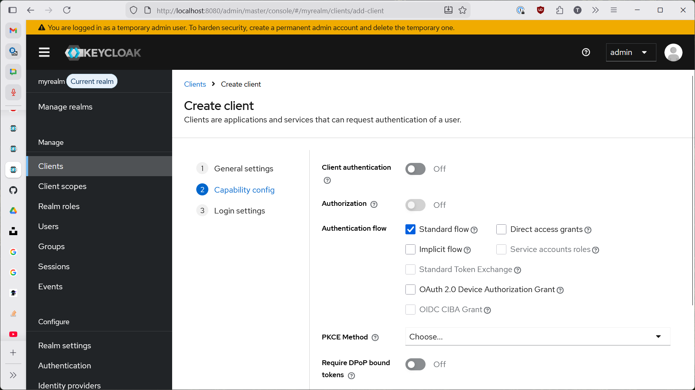

6. 「Next」をクリックします  
7. 次の値を入力します：
    - Valid redirect URIs: `https://www.keycloak.org/app/*`
    - Web origins: `https://www.keycloak.org`

上記の URI は、Keycloak が提供しているテスト用 SPA を使用するため、その SPA がホストされている場所を指しています。

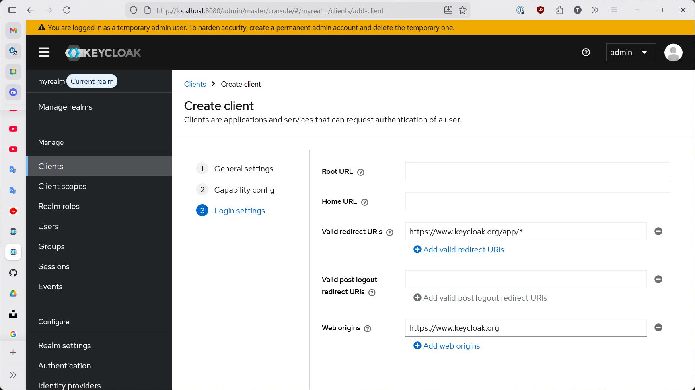

8. 「Save」をクリックします

「Save」をクリックすると、作成したクライアントの設定ページへリダイレクトされます。

クライアントが正しく動作しているかを確認するには、まず Keycloak の SPA テスト用アプリ  
[Keycloak Testing SPA](https://www.keycloak.org/app/) にアクセスします。

このページには、Keycloak クライアントに関する情報（Keycloak へのアクセス URL、クライアントが属する Realm、どのクライアントをテストするのか等）を入力するフォームがあります。

フォームには、Keycloak 管理コンソールで作成した内容と一致するデフォルト値がすでに入力されているため、そのまま使用します。

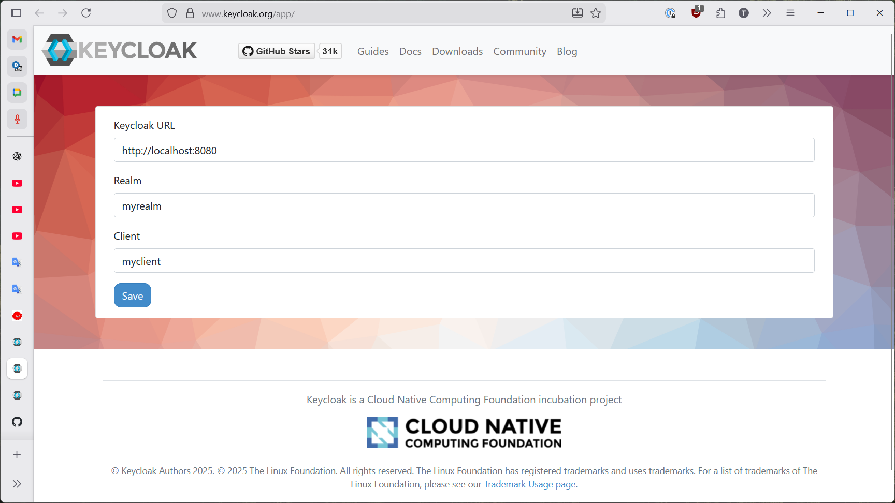

「Save」をクリックすると、「Sign in」ボタンと「Clear config」ボタンが表示されます。

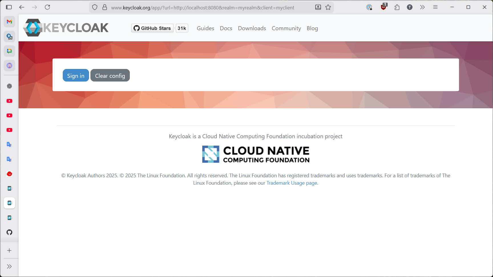

「Sign in」ボタンをクリックすると、作成したクライアントに接続された SPA にリダイレクトされます。  
この SPA は基本的にシンプルなログイン画面で、先ほどこのガイドで作成した `myuser` ユーザーの認証情報を使ってログインできます。

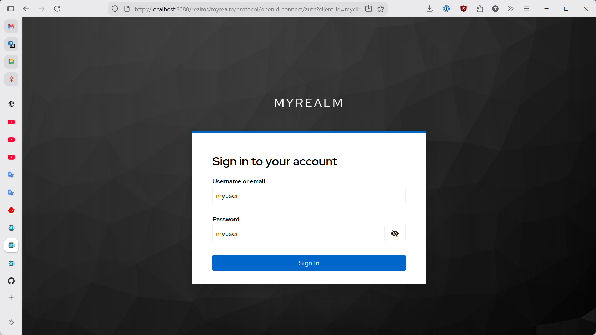

ログインできるのは、作成したユーザーが `myrealm` レルム内の `myclient` クライアントに作成されているためです。

ログイン画面の「Sign in」ボタンを初回クリックすると、アカウント情報の更新を求められます。

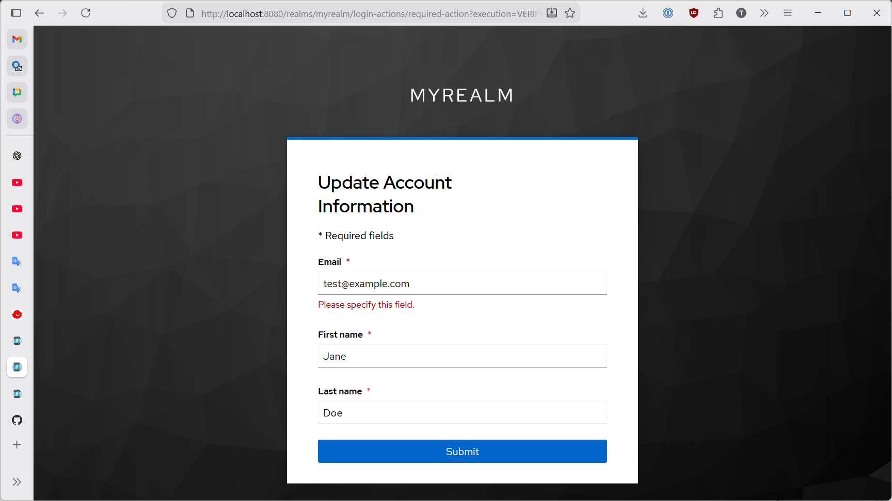

アカウント情報を更新すると、ログイン後の画面にリダイレクトされます。  
この画面にはアカウント名と「Sign out」ボタンが表示され、正常にサインインできたことを確認できます。

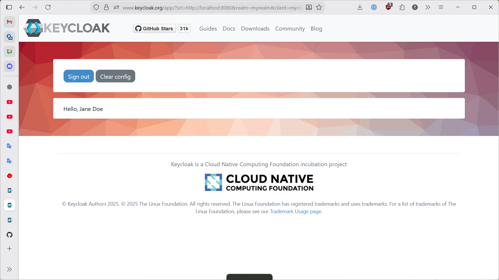

これで本ガイドは終了です。

## 次に進む場所

このガイドでは、Keycloak が学習用に公開しているテスト用アプリケーションをクライアントとして使用しました。  
次のステップは、自分のローカル環境で SPA を動作させ、Keycloak をプログラム的に実装してみることです。これは **Keycloak のクライアントサイド実装** と呼ばれるもので、次のガイドで解説を開始します：

[JavaScript ベースのシングルページアプリケーション（SPA）に Keycloak を実装する方法](https://tomato-rofiq.github.io/tomato-manuals/keycloak/jp/quickjs/)

